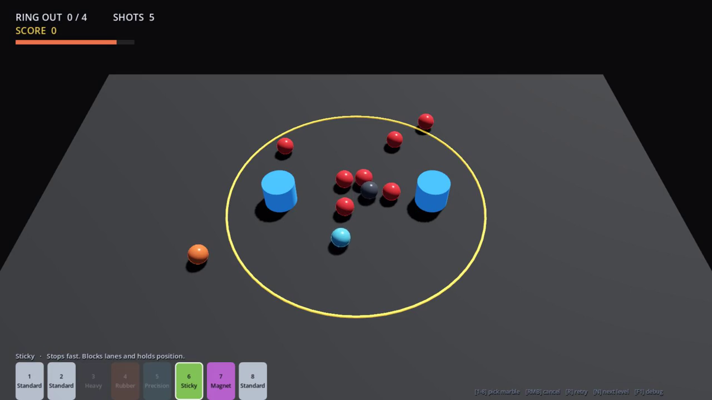

# Project Marbles — 3D Art Brief

Everything an artist needs to quote and start. Engine-ready specs, exact dimensions, and what is deliberately *not* needed.



**Gameplay video:** `docs/demo.mp4` (39 s, scripted — no human playing)
**Playable build:** `builds/windows/ProjectMarbles.exe` (Windows x64, single file, no install)

Everything visible in the video and screenshots is engine primitives with flat materials. **All of it is placeholder.**

---

## 1. Technical envelope

| | |
|---|---|
| Engine | Godot 4.7.2, Forward+ renderer |
| Delivery format | glTF 2.0 (`.glb` preferred, single file with embedded textures) |
| Units | **1 unit = 1 metre**, Y-up, -Z forward |
| Origin | Table surface sits at `Y = 0`; world origin is the centre of the table |
| Materials | PBR metal/rough. Albedo + Roughness + Metallic + Normal. ORM packed is fine |
| Colour space | Albedo sRGB, everything else linear |
| Target | PC / Steam. Baseline GPU is roughly a GTX 1050 Ti |

No animation rigs, no skinning, no LODs, no blend shapes. Nothing in this scene deforms.

---

## 2. The single most important constraint

**The camera is fixed and never moves.**

```text
Camera3D, perspective
position  (0, 4.20, -3.55)
look at   (0, 0, 0)
FOV       45°  vertical
distance  5.50 m from table centre, 50° above horizontal
```

Two consequences that should shape every modelling decision:

**A marble is about 45 pixels tall at 1080p.** The visible area is ~4.56 m of world height across 1080 px, so roughly 237 px per metre. A 0.20 m marble lands at ~47 px, and in a 720p window ~31 px. Detail finer than that is invisible. What actually reads at this size is **silhouette, base colour, the specular highlight, and the rim**. Interior detail, fine normal maps and small surface imperfections are wasted budget.

**Undersides are never seen.** The camera only ever looks down at ~50°. The bottom of the table, the inside of the hole below the lip, and the underside of any prop never appear.

---

## 3. Asset list

### 3.1 Marble ×6 — the hero asset

All six are the **same size and the same collision sphere**. They are distinguished *only* by material. This is a gameplay rule, not an art limitation — identical hitboxes keep the game balanced, so please do not vary the radius or silhouette.

```text
radius   0.10 m      diameter 0.20 m
centre   rests at Y = 0.10
mesh     one shared sphere, ~500-1500 tris is plenty
```

Six materials, in gameplay order. Current placeholder colours in brackets — treat them as intent, not as a palette to match:

| # | Name | Character to convey | Placeholder |
|---|---|---|---|
| 1 | **Standard** | Plain, honest, the baseline. Should never look weak or cheap — the design rule is that Standard stays viable all game | near-white `#CCD6E6` |
| 2 | **Heavy** | Dense, dark, metallic. Reads as *weight*. Pushes hard, moves slow | dark steel `#474D57` |
| 3 | **Rubber** | Springy, matte, high bounce | orange `#F27340` |
| 4 | **Precision** | Clean, sharp, controlled. The "scalpel" | cyan `#59CCF2` |
| 5 | **Sticky** | Soft, tacky, deadening. Stops almost instantly | green `#8CD959` |
| 6 | **Magnet** | Charged, slightly unnatural. Emits one pulse then goes inert | violet `#CC66E6` |

There is also a **Target** marble (red) — the thing you knock out of the ring. It must read as clearly *not yours* at a glance.

Art direction from the design doc: *dark table, colourful glass marbles, high contrast, tactile.* Glass is the intended fantasy, but at 47 px a full refractive shader may not pay for itself — a strong specular highlight and rim light probably sells it better and cheaper. **Your call, and worth a test.**

Each gameplay type will later carry cosmetic skins (Black Iron, Galaxy, Blood Glass…). Skins never change stats, so the material should be swappable without touching the mesh.

### 3.2 Table

```text
7.20 m (X) × 4.80 m (Z), top surface at Y = 0
```

The **edge matters** — there is no wall, and marbles roll off and fall. The rim should read clearly as a drop, since losing a marble is a real cost in the game. Currently a plain grey box.

### 3.3 Ring

```text
circle, radius 1.45 m, lies flat on the table
```

Pure gameplay boundary, no collision. A marble is "out" when its centre passes 1.55 m. It must stay legible under scattered marbles — this is the line the player reads constantly. Currently an emissive yellow torus.

### 3.4 Bumper

```text
cylinder, radius 0.18 m, height 0.30 m, stands on the table
```

A bank surface — marbles bounce off it hard. Should look bouncy/energetic. Reused several times per level.

### 3.5 Hole

```text
visual radius 0.18 m, capture radius 0.16 m
```

Marbles drop in and disappear. Needs a readable lip; the shaft below is never visible.

### 3.6 Launch strip

```text
5.60 m (X) × 0.40 m (Z), centred at Z = -1.85, flat on the table
```

Highlights only while the player is placing a marble. Should invite a click without competing with the ring.

### 3.7 Environment (optional, lowest priority)

Beyond the table is currently empty black. A surrounding environment would add a lot of mood, but it must not pull focus from a 47 px marble.

---

## 4. What is NOT needed

- Characters, UI art, icons, logos, fonts
- Animation of any kind (all motion is physics-driven)
- Any view other than the fixed camera angle
- Normal-map detail below ~2 mm — invisible at this scale
- Variant meshes per marble type — one sphere, six materials

---

## 5. Open questions for the artist

1. At ~47 px, does real glass (refraction / transmission) earn its cost, or does a faked highlight read better? A quick comparison test on two marbles would answer this before committing to all six.
2. Marbles are currently quite small on screen. Would a tighter camera or a smaller table serve the art better? Changing this is cheap now and expensive later.
3. Is a dark table the right call, given the targets are red and the ring is yellow? Contrast is the thing that has to work.
