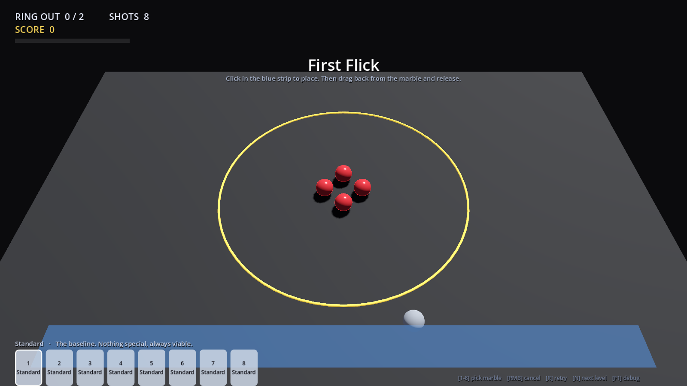

# Phase 1 Prototype — چطور اجرا کنی و چه چیزی را قضاوت کنی



---

## اجرا

Godot 4.7.2 روی سیستم شما از طریق Steam نصب است. پروژه را باز کنید و `F5` بزنید — یا مستقیم:

```bash
"E:/SteamLibrary/steamapps/common/Godot Engine/godot.windows.opt.tools.64.exe" --path "E:/Unity Games/Marbel"
```

## کنترل

| | |
|---|---|
| **کلیک در نوار آبی** | تیله را می‌گذارد |
| **نگه‌داشتن و کشیدن به عقب** | مثل تیرکمان — جهت و قدرت |
| **رها کردن** | شلیک |
| راست‌کلیک | لغو |
| `1`–`8` | انتخاب تیله از Bag قبل از گذاشتن |
| `R` | شروع دوباره‌ی همین مرحله |
| `N` / `P` | مرحله‌ی بعد / قبل |
| `F1` | Debug Overlay |
| `Esc` | خروج |

چهار مرحله هست. با `N` بین‌شان بچرخید — لازم نیست ببرید.

| | | |
|---|---|---|
| 1 | First Flick | چهار هدف، دو تا بیرون. فقط Standard |
| 2 | Break the Cluster | شش هدف، سه تا بیرون |
| 3 | First Hole | Mode دوم — دو هدف را داخل چاله بیندازید |
| 4 | Final Table | هر شش نوع تیله + دو Bumper |

---

## سؤالی که باید جواب بدهید

این Prototype برای Gate §87 ساخته شده، نه بیشتر:

> آیا Standard Marble بدون Ability و Progression و Unlock و AI، به‌اندازه‌ی کافی سرگرم‌کننده است؟

پیشنهاد می‌کنم **اول ۵ دقیقه فقط Level 1 را بازی کنید** و به Progression فکر نکنید. اگر دستتان نرفت سراغ `R` برای یک شات دیگر، جواب Gate منفی است و هیچ Featureی آن را درست نمی‌کند.

چیزهایی که ارزش دارد موقع بازی حواستان به آن‌ها باشد:

- **رابطه‌ی قدرت و فاصله** — بعد از چند شات می‌توانید حدس بزنید تیله کجا می‌ایستد؟
- **برخورد** — صدا و واکنش به‌اندازه‌ی کافی تُرد هست؟
- **Chain Reaction** — وقتی یک شات چند تیله را می‌زند، غافلگیرکننده است یا بی‌رمق؟
- **زمان مرده** — بین رها کردن و نوبت بعد چقدر منتظر می‌مانید؟
- **تفاوت تیله‌ها** (مرحله ۴) — Heavy واقعاً سنگین حس می‌شود؟ Sticky واقعاً زود می‌ایستد؟

---

## چه چیزی ساخته شد و چه چیزی نه

سند، Vertical Slice را ۱۰ مرحله + Knockout + AI + Deck Builder + Save تعریف می‌کند و خودش برای آن ۱۳ هفته تخمین می‌زند. آن کار یک‌شبه ساختنی نیست، و نصفه‌ساختنش به سؤال «فان هست یا نه» جواب بدتری می‌دهد تا یک هسته‌ی کوچکِ درست.

**هست:**
Arena استاندارد ۷.۲×۴.۸ · دوربین · هر شش نوع تیله با فیزیک کالیبره‌شده · Launch Zone و قانون Placement · Aim و Power و Flick · فیزیک غلتشی · Settle Detection · Ring Out · Mode دوم (Holes) · Ability مربوط به Magnet · Scoring کامل (Ring Out، Sink، Multi Hit، Chain، Bank، Perfect Finish، Own Marble Lost) · Win/Lose · Restart آنی · صدای برخورد سه‌لایه با Pitch متغیر · Camera Punch · Debug Overlay · ShotCommand

**نیست:**
AI · Knockout · Deck Builder · Save · Campaign · Collection · Unlock · شش مرحله‌ی باقی‌مانده · Art نهایی · موسیقی

---

## تست‌ها

```bash
# §73 Test A/B/C/D — مسافت حرکت و تکرارپذیری
godot --headless --script res://tools/calibrate.gd

# کل حلقه‌ی بازی: هر چهار مرحله تا برد یا باخت
godot --headless --script res://tools/smoke.gd

# مسیر واقعی موس: گذاشتن، کشیدن، رها کردن
godot --script res://tools/input_test.gd --resolution 1280x720
```

وضعیت فعلی `calibrate`:

```text
  marble      power   target    actual     err    verdict
  standard    0.25    1.26 m    1.16 m    -8.3%   ok
  standard    0.50    2.52 m    2.54 m    +0.5%   ok
  standard    1.00    5.05 m    5.04 m    -0.1%   ok
  heavy       1.00    4.00 m    4.00 m    +0.0%   ok
  rubber      1.00    5.80 m    5.79 m    -0.2%   ok
  precision   1.00    3.60 m    3.60 m    +0.0%   ok
  sticky      1.00    2.80 m    2.80 m    +0.0%   ok
  magnet      1.00    4.70 m    4.70 m    -0.0%   ok
  repeatability (12 identical shots)   spread 0.0000 m   ok
```

تکرارپذیری **دقیقاً صفر** است — شات یکسان روی همین Build نتیجه‌ی بیت‌به‌بیت یکسان می‌دهد. این چیزی است که §73 Test D می‌خواست.

---

## چیزهایی که حین ساخت پیدا شد و در سند اصلاح شد

### ۱. ستون Bounce بازی را غیرقابل‌برد می‌کرد

مهم‌ترین مورد. سند `0.35` را به‌عنوان «Wall Bounciness» داده بود، ولی در Godot (و Unity) یک جسم **یک** Restitution دارد که روی برخورد **تیله با تیله** هم اعمال می‌شود. با `0.35` هر برخورد ~۴۴٪ انرژی را نابود می‌کرد.

اندازه‌گیری‌شده: یک شات دقیق و تقریباً تمام‌قدرت، هدف را فقط تا شعاع `0.94 m` می‌برد — در حالی که Ring Out به `1.55 m` نیاز دارد. یعنی بازی عملاً بردنی نبود، و Chain Reaction که §89 هسته‌ی حس بازی می‌داندش اصلاً اتفاق نمی‌افتاد.

شیشه‌ی واقعی حدود `0.9` است. با اعداد جدید همان شات دقیقاً به `1.55` می‌رسد.

**عارضه:** Rubber دیگر تنها تیله‌ی جهنده نیست، فقط جهنده‌ترین است.

### ۲. جدول Damping با Travel Targetها نمی‌خواند — چون فرمولش ناقص بود

`distance = v₀ / lin_damp` غلط است. وقتی کره می‌غلتد، Angular Damping هم از طریق قید غلتش سرعت خطی را می‌خورد:

```text
distance = v₀ / ( (5/7) × (lin_damp + 0.4 × ang_damp) )
```

مقادیر واقعی حدود ۱۰٪ بالاتر از چیزی هستند که روی کاغذ درآمده بود. `tools/calibrate.gd` حالا آن‌ها را از روی اندازه‌گیری حل می‌کند.

### ۳. آستانه‌ی Velocity Floor منحنی قدرت را خم می‌کرد

Floor یک مقدار **ثابت** از هر شات کم می‌کند، پس شات‌های آرام را به‌طور نامتناسبی ضعیف می‌کند. با آستانه‌ی `0.50`، شات ۲۵٪ قدرت ۲۴٪ کوتاه می‌آمد. با `0.25` و شتاب منفی `0.80` خطا به ۸٪ رسید و منحنی خطی ماند.

### ۴. Resolution خیلی طول می‌کشید

یک تیله‌ی تنها ~۳.۳ ثانیه می‌ایستد، ولی Resolution کامل تا ۶ ثانیه می‌رفت — انتظار برای یک عقب‌مانده‌ی در حال خزیدن. Timeout تک‌مرحله‌ای ۱۰ ثانیه‌ای با یک Sweep پلکانی (۳ / ۷ / ۱۱ ثانیه) جایگزین شد. میانگین الان ~۳.۵ ثانیه است.

### ۵. Bank Shot روی هر شاتی فعال می‌شد

کف میز هم یک Surface است و هر تیله رویش استراحت می‌کند، پس `touched_bank` همیشه true می‌شد و `+150` در مراحل بدون Bumper هم داده می‌شد. حالا فقط Objectهایی که `bank_surface` علامت خورده‌اند حساب می‌شوند.

### ۶. سه باگ فیزیکی مخصوص موتور

- `apply_central_impulse()` روی جسمی که همان فریم ساخته شده بی‌صدا دور ریخته می‌شود. شات حالا داخل `_integrate_forces` اعمال می‌شود که تضمین‌شده با جسم زنده اجرا می‌شود. (علامتش: تیله به‌جای ۵ متر، ۰.۹ متر می‌خزید — فقط از چرخشش.)
- `freeze = true` موقع Placement و `freeze = false` در لحظه‌ی شلیک، سرعت را می‌بلعد. تیله‌ی گذاشته‌شده اصلاً Freeze نمی‌شود — روی ارتفاع استراحت خودش می‌ایستد.
- Placement از موقعیت موسِ فریم قبل استفاده می‌کرد. حالا در لحظه‌ی کلیک دوباره Projection می‌شود.

### ۷. Level 05 سند: تیله‌ها ۰.۰۲ متر فاصله داشتند

قبلاً در REVIEW علامت زده بودم؛ در چیدمان مرحله‌ی ۴ همین Prototype اعمال شد (`±0.12, ±0.22` به‌جای `±0.11, ±0.20`).

---

## تصمیم‌هایی که هنوز روی میز است

| # | موضوع |
|---|---|
| 1 | **دیوار پیرامونی** — اینجا گزینه A فرض شده: میز باز، تیله از لبه می‌افتد. Bank Surface فقط Bumper است |
| 2 | **Rubber** در مراحل بدون Bumper کار خاصی ندارد — با اصلاح Restitution این مشکل بدتر هم شد |
| 3 | **Shot تمام‌قدرت** تیله را از میز بیرون می‌اندازد (۵.۰۵ متر > ۴.۲۵ متر عمق مفید). عمدی و خوب است، ولی Tutorial باید پوشش بدهد |
| 4 | **Simulator مخصوص AI** هنوز Spike نشده — Phase 4 را بلاک می‌کند |
| 5 | **سختی مراحل** حدسی است. Bot تستی در ۸ شات معمولاً یکی را بیرون می‌اندازد؛ هدف‌های ۲/۳/۴ بر همین اساس تنظیم شده‌اند و بعد از بازی شما باید دوباره تنظیم شوند |

---

## الحاق — AI و Knockout

Phase 4 ساخته شد. دو مرحله‌ی جدید: **Level 5 First Duel** (AI Easy) و **Level 6 The Rematch** (AI Normal، با Bumper).

### ریسک §19 حل شد

سند هشدار داده بود که کل طراحی AI فرض می‌کند می‌شود صحنه‌ی فیزیک را سریع‌تر از زمان واقعی Simulate کرد، و Godot این را ندارد. گزینه‌ی پیشنهادی (Simulator دیسک دوبعدی اختصاصی) پیاده شد: `scripts/sim.gd`.

### دقتش چقدر است

```text
Shot آزاد      میانگین خطا 0.011 m   بدترین 0.058 m
شکستن خوشه     توافق دقیق 77%        ±۱ تیله 100%
```

**یک تست که فرض خودم را رد کرد:** طبیعی است فرض کنیم ۲۳٪ باقی‌مانده «آشوب» است و هیچ مدلی بهتر نمی‌شود. تست کردم — همان Shot با جابه‌جایی **۱ میلی‌متری** شلیک‌کننده، ۲۰ جفت، **۱۰۰٪ نتیجه‌ی یکسان**. پس آشوب نیست و این ضعف مدل است، نه قانون طبیعت.

علتش احتمالاً این است که Simulator تماس‌ها را جفت‌به‌جفت حل می‌کند و Jolt کل خوشه را هم‌زمان. درست کردنش یعنی نوشتن Solver هم‌زمان، که الان لازم نیست چون AI **رتبه‌بندی** می‌کند نه گزارش موقعیت، و «±۱ تیله ۱۰۰٪» یعنی هیچ Shotی را به‌کلی اشتباه نمی‌خواند. **ولی به‌عنوان بدهی ثبت شده** — اگر AI حس شد میز را اشتباه می‌خواند، اول همین‌جا را نگاه کنید.

### AI چطور بازی می‌کند

```text
                 Candidates   Aim Error   Think
Easy              24           ±4.0°       ~115 ms
Normal            60           ±1.5°       ~310 ms
```

بودجه‌ی §61 برابر ۱۵۰۰ میلی‌ثانیه است، پس جای زیادی باقی مانده. AI هیچ قانونی را دور نمی‌زند — همان Launch Zone، همان Bag، همان فیزیک. تنها چیزی که Difficulty عوض می‌کند عمق جست‌وجو و میزان خطایی است که **عمداً** به شات خودش اضافه می‌کند.

در تست، AI مقابل یک Bot متوسط **۶۷٪** برد.

### باگی که حین تست AI پیدا شد

AI موقعیت Placement را بدون چک کردن خالی بودنش انتخاب می‌کرد، در حالی که تیله‌های مصرف‌شده‌ی خودش داخل Launch Zone جمع می‌شوند. وقتی Placement رد می‌شد، نوبت هیچ‌وقت تمام نمی‌شد — یعنی **کل بازی قفل می‌کرد**، نه فقط تست. حالا در نوار Launch نزدیک‌ترین جای خالی را پیدا می‌کند، و اگر هیچ جایی نبود نوبتش را از دست می‌دهد به‌جای اینکه معلق بماند.

### هنوز ساخته نشده

Deck Builder · Save · Collection · Unlock · Campaign · چهار مرحله‌ی باقی‌مانده · AI Hard (پیاده هست ولی استفاده نمی‌شود)

### تست

```bash
godot --headless --script res://tools/sim_check.gd   # دقت Simulator + تست آشوب
godot --headless --script res://tools/ai_test.gd     # AI مسابقه‌ی کامل بازی می‌کند
```
