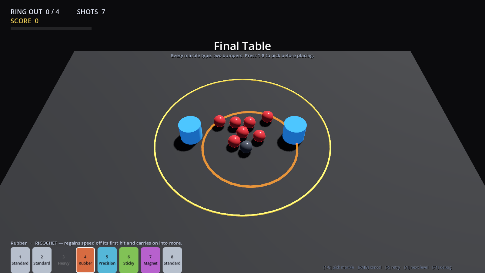
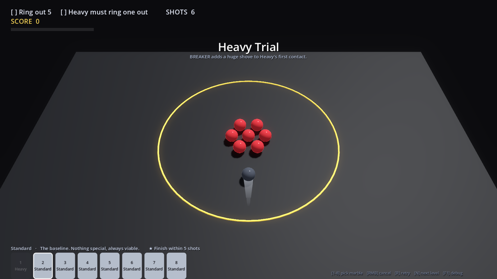

# Phase 1 Prototype — چطور اجرا کنی و چه چیزی را قضاوت کنی


---

## اجرا

Godot 4.7.2 روی سیستم شما از طریق Steam نصب است. پروژه را باز کنید و `F5` بزنید — یا مستقیم:

```bash
"E:/SteamLibrary/steamapps/common/Godot Engine/godot.windows.opt.tools.64.exe" --path "E:/Unity Games/Marbel"
```

## کنترل

| | |
|---|---|
| **کلیک در نوار آبی** | تیله را می‌گذارد |
| **نگه‌داشتن و کشیدن به عقب** | مثل تیرکمان — جهت و قدرت |
| **رها کردن** | شلیک |
| راست‌کلیک | لغو |
| `1`–`8` | انتخاب تیله از Bag قبل از گذاشتن |
| `R` | شروع دوباره‌ی همین مرحله |
| `N` / `P` | مرحله‌ی بعد / قبل |
| `F1` | Debug Overlay |
| `Esc` | خروج |

چهار مرحله هست. با `N` بین‌شان بچرخید — لازم نیست ببرید.

| | | |
|---|---|---|
| 1 | First Flick | چهار هدف، دو تا بیرون. فقط Standard |
| 2 | Break the Cluster | شش هدف، سه تا بیرون |
| 3 | First Hole | Mode دوم — دو هدف را داخل چاله بیندازید |
| 4 | Final Table | هر شش نوع تیله + دو Bumper |

---

## سؤالی که باید جواب بدهید

این Prototype برای Gate §87 ساخته شده، نه بیشتر:

> آیا Standard Marble بدون Ability و Progression و Unlock و AI، به‌اندازه‌ی کافی سرگرم‌کننده است؟

پیشنهاد می‌کنم **اول ۵ دقیقه فقط Level 1 را بازی کنید** و به Progression فکر نکنید. اگر دستتان نرفت سراغ `R` برای یک شات دیگر، جواب Gate منفی است و هیچ Featureی آن را درست نمی‌کند.

چیزهایی که ارزش دارد موقع بازی حواستان به آن‌ها باشد:

- **رابطه‌ی قدرت و فاصله** — بعد از چند شات می‌توانید حدس بزنید تیله کجا می‌ایستد؟
- **برخورد** — صدا و واکنش به‌اندازه‌ی کافی تُرد هست؟
- **Chain Reaction** — وقتی یک شات چند تیله را می‌زند، غافلگیرکننده است یا بی‌رمق؟
- **زمان مرده** — بین رها کردن و نوبت بعد چقدر منتظر می‌مانید؟
- **تفاوت تیله‌ها** (مرحله ۴) — Heavy واقعاً سنگین حس می‌شود؟ Sticky واقعاً زود می‌ایستد؟

---

## چه چیزی ساخته شد و چه چیزی نه

سند، Vertical Slice را ۱۰ مرحله + Knockout + AI + Deck Builder + Save تعریف می‌کند و خودش برای آن ۱۳ هفته تخمین می‌زند. آن کار یک‌شبه ساختنی نیست، و نصفه‌ساختنش به سؤال «فان هست یا نه» جواب بدتری می‌دهد تا یک هسته‌ی کوچکِ درست.

**هست:**
Arena استاندارد ۷.۲×۴.۸ · دوربین · هر شش نوع تیله با فیزیک کالیبره‌شده · Launch Zone و قانون Placement · Aim و Power و Flick · فیزیک غلتشی · Settle Detection · Ring Out · Mode دوم (Holes) · Ability مربوط به Magnet · Scoring کامل (Ring Out، Sink، Multi Hit، Chain، Bank، Perfect Finish، Own Marble Lost) · Win/Lose · Restart آنی · صدای برخورد سه‌لایه با Pitch متغیر · Camera Punch · Debug Overlay · ShotCommand

**نیست:**
AI · Knockout · Deck Builder · Save · Campaign · Collection · Unlock · شش مرحله‌ی باقی‌مانده · Art نهایی · موسیقی

---

## تست‌ها

```bash
# §73 Test A/B/C/D — مسافت حرکت و تکرارپذیری
godot --headless --script res://tools/calibrate.gd

# کل حلقه‌ی بازی: هر چهار مرحله تا برد یا باخت
godot --headless --script res://tools/smoke.gd

# مسیر واقعی موس: گذاشتن، کشیدن، رها کردن
godot --script res://tools/input_test.gd --resolution 1280x720
```

وضعیت فعلی `calibrate`:

```text
  marble      power   target    actual     err    verdict
  standard    0.25    1.26 m    1.16 m    -8.3%   ok
  standard    0.50    2.52 m    2.54 m    +0.5%   ok
  standard    1.00    5.05 m    5.04 m    -0.1%   ok
  heavy       1.00    4.00 m    4.00 m    +0.0%   ok
  rubber      1.00    5.80 m    5.79 m    -0.2%   ok
  precision   1.00    3.60 m    3.60 m    +0.0%   ok
  sticky      1.00    2.80 m    2.80 m    +0.0%   ok
  magnet      1.00    4.70 m    4.70 m    -0.0%   ok
  repeatability (12 identical shots)   spread 0.0000 m   ok
```

تکرارپذیری **دقیقاً صفر** است — شات یکسان روی همین Build نتیجه‌ی بیت‌به‌بیت یکسان می‌دهد. این چیزی است که §73 Test D می‌خواست.

---

## چیزهایی که حین ساخت پیدا شد و در سند اصلاح شد

### ۱. ستون Bounce بازی را غیرقابل‌برد می‌کرد

مهم‌ترین مورد. سند `0.35` را به‌عنوان «Wall Bounciness» داده بود، ولی در Godot (و Unity) یک جسم **یک** Restitution دارد که روی برخورد **تیله با تیله** هم اعمال می‌شود. با `0.35` هر برخورد ~۴۴٪ انرژی را نابود می‌کرد.

اندازه‌گیری‌شده: یک شات دقیق و تقریباً تمام‌قدرت، هدف را فقط تا شعاع `0.94 m` می‌برد — در حالی که Ring Out به `1.55 m` نیاز دارد. یعنی بازی عملاً بردنی نبود، و Chain Reaction که §89 هسته‌ی حس بازی می‌داندش اصلاً اتفاق نمی‌افتاد.

شیشه‌ی واقعی حدود `0.9` است. با اعداد جدید همان شات دقیقاً به `1.55` می‌رسد.

**عارضه:** Rubber دیگر تنها تیله‌ی جهنده نیست، فقط جهنده‌ترین است.

### ۲. جدول Damping با Travel Targetها نمی‌خواند — چون فرمولش ناقص بود

`distance = v₀ / lin_damp` غلط است. وقتی کره می‌غلتد، Angular Damping هم از طریق قید غلتش سرعت خطی را می‌خورد:

```text
distance = v₀ / ( (5/7) × (lin_damp + 0.4 × ang_damp) )
```

مقادیر واقعی حدود ۱۰٪ بالاتر از چیزی هستند که روی کاغذ درآمده بود. `tools/calibrate.gd` حالا آن‌ها را از روی اندازه‌گیری حل می‌کند.

### ۳. آستانه‌ی Velocity Floor منحنی قدرت را خم می‌کرد

Floor یک مقدار **ثابت** از هر شات کم می‌کند، پس شات‌های آرام را به‌طور نامتناسبی ضعیف می‌کند. با آستانه‌ی `0.50`، شات ۲۵٪ قدرت ۲۴٪ کوتاه می‌آمد. با `0.25` و شتاب منفی `0.80` خطا به ۸٪ رسید و منحنی خطی ماند.

### ۴. Resolution خیلی طول می‌کشید

یک تیله‌ی تنها ~۳.۳ ثانیه می‌ایستد، ولی Resolution کامل تا ۶ ثانیه می‌رفت — انتظار برای یک عقب‌مانده‌ی در حال خزیدن. Timeout تک‌مرحله‌ای ۱۰ ثانیه‌ای با یک Sweep پلکانی (۳ / ۷ / ۱۱ ثانیه) جایگزین شد. میانگین الان ~۳.۵ ثانیه است.

### ۵. Bank Shot روی هر شاتی فعال می‌شد

کف میز هم یک Surface است و هر تیله رویش استراحت می‌کند، پس `touched_bank` همیشه true می‌شد و `+150` در مراحل بدون Bumper هم داده می‌شد. حالا فقط Objectهایی که `bank_surface` علامت خورده‌اند حساب می‌شوند.

### ۶. سه باگ فیزیکی مخصوص موتور

- `apply_central_impulse()` روی جسمی که همان فریم ساخته شده بی‌صدا دور ریخته می‌شود. شات حالا داخل `_integrate_forces` اعمال می‌شود که تضمین‌شده با جسم زنده اجرا می‌شود. (علامتش: تیله به‌جای ۵ متر، ۰.۹ متر می‌خزید — فقط از چرخشش.)
- `freeze = true` موقع Placement و `freeze = false` در لحظه‌ی شلیک، سرعت را می‌بلعد. تیله‌ی گذاشته‌شده اصلاً Freeze نمی‌شود — روی ارتفاع استراحت خودش می‌ایستد.
- Placement از موقعیت موسِ فریم قبل استفاده می‌کرد. حالا در لحظه‌ی کلیک دوباره Projection می‌شود.

### ۷. Level 05 سند: تیله‌ها ۰.۰۲ متر فاصله داشتند

قبلاً در REVIEW علامت زده بودم؛ در چیدمان مرحله‌ی ۴ همین Prototype اعمال شد (`±0.12, ±0.22` به‌جای `±0.11, ±0.20`).

---

## تصمیم‌هایی که هنوز روی میز است

| # | موضوع |
|---|---|
| 1 | **دیوار پیرامونی** — اینجا گزینه A فرض شده: میز باز، تیله از لبه می‌افتد. Bank Surface فقط Bumper است |
| 2 | **Rubber** در مراحل بدون Bumper کار خاصی ندارد — با اصلاح Restitution این مشکل بدتر هم شد |
| 3 | **Shot تمام‌قدرت** تیله را از میز بیرون می‌اندازد (۵.۰۵ متر > ۴.۲۵ متر عمق مفید). عمدی و خوب است، ولی Tutorial باید پوشش بدهد |
| 4 | **Simulator مخصوص AI** هنوز Spike نشده — Phase 4 را بلاک می‌کند |
| 5 | **سختی مراحل** حدسی است. Bot تستی در ۸ شات معمولاً یکی را بیرون می‌اندازد؛ هدف‌های ۲/۳/۴ بر همین اساس تنظیم شده‌اند و بعد از بازی شما باید دوباره تنظیم شوند |

---

## الحاق — AI و Knockout

Phase 4 ساخته شد. دو مرحله‌ی جدید: **Level 5 First Duel** (AI Easy) و **Level 6 The Rematch** (AI Normal، با Bumper).

### ریسک §19 حل شد

سند هشدار داده بود که کل طراحی AI فرض می‌کند می‌شود صحنه‌ی فیزیک را سریع‌تر از زمان واقعی Simulate کرد، و Godot این را ندارد. گزینه‌ی پیشنهادی (Simulator دیسک دوبعدی اختصاصی) پیاده شد: `scripts/sim.gd`.

### دقتش چقدر است

```text
Shot آزاد      میانگین خطا 0.011 m   بدترین 0.058 m
شکستن خوشه     توافق دقیق 77%        ±۱ تیله 100%
```

**یک تست که فرض خودم را رد کرد:** طبیعی است فرض کنیم ۲۳٪ باقی‌مانده «آشوب» است و هیچ مدلی بهتر نمی‌شود. تست کردم — همان Shot با جابه‌جایی **۱ میلی‌متری** شلیک‌کننده، ۲۰ جفت، **۱۰۰٪ نتیجه‌ی یکسان**. پس آشوب نیست و این ضعف مدل است، نه قانون طبیعت.

علتش احتمالاً این است که Simulator تماس‌ها را جفت‌به‌جفت حل می‌کند و Jolt کل خوشه را هم‌زمان. درست کردنش یعنی نوشتن Solver هم‌زمان، که الان لازم نیست چون AI **رتبه‌بندی** می‌کند نه گزارش موقعیت، و «±۱ تیله ۱۰۰٪» یعنی هیچ Shotی را به‌کلی اشتباه نمی‌خواند. **ولی به‌عنوان بدهی ثبت شده** — اگر AI حس شد میز را اشتباه می‌خواند، اول همین‌جا را نگاه کنید.

### AI چطور بازی می‌کند

```text
                 Candidates   Aim Error   Think
Easy              24           ±4.0°       ~115 ms
Normal            60           ±1.5°       ~310 ms
```

بودجه‌ی §61 برابر ۱۵۰۰ میلی‌ثانیه است، پس جای زیادی باقی مانده. AI هیچ قانونی را دور نمی‌زند — همان Launch Zone، همان Bag، همان فیزیک. تنها چیزی که Difficulty عوض می‌کند عمق جست‌وجو و میزان خطایی است که **عمداً** به شات خودش اضافه می‌کند.

در تست، AI مقابل یک Bot متوسط **۶۷٪** برد.

### باگی که حین تست AI پیدا شد

AI موقعیت Placement را بدون چک کردن خالی بودنش انتخاب می‌کرد، در حالی که تیله‌های مصرف‌شده‌ی خودش داخل Launch Zone جمع می‌شوند. وقتی Placement رد می‌شد، نوبت هیچ‌وقت تمام نمی‌شد — یعنی **کل بازی قفل می‌کرد**، نه فقط تست. حالا در نوار Launch نزدیک‌ترین جای خالی را پیدا می‌کند، و اگر هیچ جایی نبود نوبتش را از دست می‌دهد به‌جای اینکه معلق بماند.

### هنوز ساخته نشده

Deck Builder · Save · Collection · Unlock · Campaign · چهار مرحله‌ی باقی‌مانده · AI Hard (پیاده هست ولی استفاده نمی‌شود)

### تست

```bash
godot --headless --script res://tools/sim_check.gd   # دقت Simulator + تست آشوب
godot --headless --script res://tools/ai_test.gd     # AI مسابقه‌ی کامل بازی می‌کند
```

---

## الحاق ۲ — قابلیت تیله‌ها

قبلاً فقط Magnet قابلیت داشت و آن هم ضعیف بود (حداکثر ۰.۳۹ متر جابه‌جایی). بقیه فقط تفاوت آماری داشتند که در بازی حس نمی‌شد. حالا هر پنج تیله‌ی Special یک قابلیت واقعی دارند که روی Event System §13 سوار است.



| تیله | Event | قابلیت |
|---|---|---|
| **Heavy** | OnFirstCollision | **BREAKER** — به اولین هدفی که می‌زند `3.2 m/s` ضربه‌ی اضافه می‌دهد |
| **Rubber** | OnFirstCollision | **RICOCHET** — بعد از اولین برخورد `2.1 m/s` سرعت پس می‌گیرد و ادامه می‌دهد |
| **Precision** | OnFirstCollision | **PINPOINT** — اولین تیله‌ای که لمس کند را دقیقاً در جهتی که نشانه گرفته بودید می‌فرستد |
| **Sticky** | OnStop | **ANCHOR** — جایی که بایستد پیچ می‌شود. هیچ‌چیز دیگر تکانش نمی‌دهد |
| **Magnet** | OnStop | **PULSE** — شعاع از `0.75` به `1.15` و ایمپالس از `0.55` به `1.90` |
| Standard | — | هیچ. عمداً. مبنای Balance است |

همه از قوانین §12 پیروی می‌کنند: یک قابلیت، یک جمله، بدون Input جدید، فیزیک را عوض می‌کنند نه امتیاز را.

### دیده شدن

هر قابلیت یک حلقه‌ی موج‌دار روی زمین پخش می‌کند با رنگ مخصوص خودش، به‌اضافه‌ی Camera Punch و صدا. حلقه با **بزرگ کردن شعاع** انیمیت می‌شود نه Scale کردن نود — چون Scale یکنواخت ضخامت لوله را هم بزرگ می‌کند و به‌جای موج شبیه یک دونات در حال باد شدن می‌شود.

### نکته‌های پیاده‌سازی

- **Anchor** واقعاً Freeze می‌شود، پس Magnet هم نمی‌تواند تکانش دهد. در دید AI جرمش `1000` گزارش می‌شود تا شات‌هایی طراحی نکند که فرض می‌کنند می‌شود هلش داد.
- **Pinpoint** جهت را از `ShotContext.aim` می‌گیرد، یعنی همان خطی که بازیکن کشیده — نه هندسه‌ی تماس.
- **Simulator مربوط به AI هنوز قابلیت‌ها را مدل نمی‌کند.** یعنی AI ارزش Heavy و Precision را دست‌کم می‌گیرد. فعلاً عملاً یک هندیکپ است، ولی اگر بعداً AI سخت‌تر لازم شد اولین جایی است که باید اضافه شود.

---

## الحاق ۳ — Phase 5 (Progression) و ۱۰ Level کامل

تصمیم **3D قفل شد.** دوربین ثابت است و همه چیز روی یک صفحه، یعنی عملاً ۲.۵بعدی — ارزان‌ترین نوع سه‌بعدی از نظر آرت.

### Campaign کامل شد

هر ده Level سند (§64) ساخته شد، با Trialها:

| # | Level | Mode | Trial / Reward |
|---|---|---|---|
| 1 | First Flick | Ringer | Deck Builder باز می‌شود |
| 2 | Break the Cluster | Ringer | — |
| 3 | Precision Trial | Ringer | Precision |
| 4 | First Hole | Holes | — |
| 5 | Heavy Trial | Ringer | Heavy |
| 6 | Around the Wall | Ringer | Rubber |
| 7 | Magnetic Pull | Holes | Magnet |
| 8 | First Duel | Duel (Easy) | — |
| 9 | Hold Your Ground | Duel (Easy) | Sticky |
| 10 | Final Table | Duel (Normal) | پایان Chapter 1 |

### Objective حالا Data است، نه کد

GDD §19 می‌خواست Objective سیستم Data-Driven باشد. قبلاً `goal` و `progress` داخل حلقه‌ی بازی Hardcode بود. حالا هر Level سه دسته Objective اعلام می‌کند:

```gdscript
"primary":    [{"type": "ring_out", "count": 3}]
"additional": [{"type": "marble_hits_target", "marble": "precision"}]
"secondary":  [{"type": "within_shots", "count": 5}]
```

`primary` و `additional` هر دو باید پاس شوند تا Level تمام شود؛ `secondary` اختیاری است و هر کدام یک Medal می‌دهد (§65). چهارده نوع Objective تعریف شده.

### Save و Unlock

`user://save.json` — Marbleهای باز شده، Levelهای تمام‌شده، Best Score، Medal، Loadout ذخیره‌شده، و آمار. Best Score فقط روی برد ثبت می‌شود (§55). فایل خراب یا نسخه‌ی قدیمی باعث Crash نمی‌شود، به Default برمی‌گردد — تست شده.

### سه صفحه‌ی جدید

- **Level Select** — Medalها، Best Score، Levelهای قفل، برچسب Trial
- **Deck Builder** — ۸ Slot، قانون §57 (Standard نامحدود، هر Special یکی)، Loadout ذخیره می‌شود
- **Collection** — Barهای §27 به‌جای اعداد خام فیزیک، قفل‌ها به شکل `???`

### `Esc` دیگر از بازی خارج نمی‌شود

به Campaign برمی‌گردد. از دست دادن یک دوئل با یک کلید اشتباهی راه قابل‌قبولی برای ترک مسابقه نبود.

### باگی که Validator گرفت

تست `progression_test.gd` چیدمان هر Level را چک می‌کند. سه خوشه (L5، L8، L10) فاصله‌ی مرکزها `0.239`–`0.240` متر داشتند، زیر حداقل `0.25` که برای چیدمان دستی گذاشته بودیم — یعنی در فریم اول Penetration و Jitter می‌دادند. اصلاح شد.

Validator این‌ها را هم چک می‌کند: Objective بدون Bank Surface، Trial که Marbleی را می‌خواهد که در Bag نیست، Bag با اندازه‌ی غلط، و اینکه زنجیره‌ی Unlock واقعاً به هر شش Marble می‌رسد.

### تست‌ها

```bash
godot --headless --script res://tools/calibrate.gd         # فیزیک
godot --headless --script res://tools/sim_check.gd         # دقت Simulator
godot --headless --script res://tools/progression_test.gd  # Save، Objective، Level data
godot --headless --script res://tools/smoke.gd             # کل حلقه
godot --headless --script res://tools/ai_test.gd           # AI مسابقه بازی می‌کند
```

### باقی‌مانده (Phase 6)

Material و VFX نهایی · Slow Motion · Audio Pass · Transition · Accessibility · Controller · Localization

---

## الحاق ۴ — Phase 6 (Polish)



### Accessibility (§71)

صفحه‌ی Settings با کلید `O`. همه‌ی گزینه‌ها بلافاصله در `user://settings.json` ذخیره می‌شوند و جدا از Save کمپین نگه داشته شده‌اند — پاک کردن پیشرفت نباید تنظیمات دسترسی‌پذیری را هم پاک کند.

- **Screen Shake** از ۰ تا ۱۰۰٪ (صفر یعنی کاملاً خاموش)
- **Slow Motion** قابل خاموش کردن
- **Aim Guide** سه حالت: خاموش / کوتاه / بلند
- **Colourblind Markers** — نشانه‌ی شکلی بالای هر تیله (`◆` هدف، `●` شما، `▲` حریف) تا تشخیص مالکیت به رنگ وابسته نباشد
- **Text Size** از ۸۰٪ تا ۱۶۰٪
- **Volume**
- **مکث نوبت حریف** قابل خاموش کردن
- پاک کردن پیشرفت، با تأیید دو مرحله‌ای

### Controller (§8.1)

- **Left Stick** مکان‌نما را در نوار Launch حرکت می‌دهد
- **A** می‌گذارد و تأیید می‌کند · **B** لغو
- **Right Stick** نشانه‌گیری
- **RT** نگه دارید تا قدرت جمع شود، رها کنید تا شلیک شود
- **LB / RB** تعویض تیله · **Y** شروع دوباره · **Start** بازگشت به کمپین

حالت Controller خودش فعال می‌شود — به محض اینکه استیک یا ماشه تکان بخورد — و با اولین حرکت موس برمی‌گردد. کسی مجبور نیست در منو حالت کنترل انتخاب کند. هر دو مسیر همان `ShotCommand` §69 را می‌سازند.

### Slow Motion (§54)

فقط در لحظه‌ای فعال می‌شود که Objective اصلی کامل شود. دلیلش مهم است: در آن لحظه Level از قبل برده شده و Ring Outها Latch شده‌اند (§36)، پس فیزیکِ کندتر نمی‌تواند نتیجه‌ای را پس بگیرد — حداکثر یکی اضافه می‌کند. هر جای زودتری در شات، داشت نتیجه‌ای را عوض می‌کرد که بازیکن قبلاً به دست آورده بود.

شمارش معکوسش با ساعت واقعی است نه `delta`، چون `delta` خودش در همان مدت Scale شده است.

### VFX و Material

- Marbleها: Clearcoat، Specular تیزتر، Rim قوی‌تر، Emission خیلی کم. در ~۴۵ پیکسل چیزی که خوانده می‌شود همین است نه جزئیات سطح
- **Trail** پشت تیله‌های در حال حرکت، که به سمت دم باریک می‌شود
- Glow و SSAO روی صحنه
- Ring و Bumper با Emission

### Audio (§53-55)

سه صدای برخورد قبلی، به‌علاوه: Chime برای امتیاز، Thud برای از دست دادن تیله، آرپژ کوتاه برای برد، دو نت نزولی برای باخت، و یک Pad موسیقی هشت‌ثانیه‌ای Loop که از چهار سینوس دیتیون‌شده ساخته می‌شود. هنوز هیچ فایل صوتی در ریپو نیست — همه در Runtime سنتز می‌شوند.

### Transitions

Fade بین منو، Level و Restart.

### `Esc`

دیگر از بازی خارج نمی‌شود، به کمپین برمی‌گردد.

---

## الحاق ۵ — Juice

هدف: حس بازی به فلسفه‌ی Balatro نزدیک شود. طبق §52 آن چیزی که گرفته می‌شود **فلسفه** است — Feedback قوی، عددهای بزرگ، Transition سریع، Escalation — نه ظاهرش. نه Card Layout، نه پالت، نه CRT.

### قاعده‌ی حاکم

بلندی هر Event به اندازه‌ی اهمیتش. یک تماس آرام فقط یک تیک می‌گیرد. شاتی که Level را می‌برد همه‌چیز را می‌گیرد.

| | |
|---|---|
| **Score Popup** | عدد از نقطه‌ی برخورد بیرون می‌پرد، با Overshoot و چرخش کم، بالا می‌رود و محو می‌شود |
| **Escalation** | هر Event بعدی در همان شات **بزرگ‌تر، داغ‌تر و زیرتر** از قبلی است. مهم‌ترین تکه‌ی کل Juice همین است |
| **Combo** | وسط صفحه `3× COMBO` با Punch |
| **Hit Stop** | فریز کوتاه روی برخوردهای سنگین؛ در تست ۸٪ فریم‌ها |
| **Squash & Stretch** | Mesh در محور برخورد پهن می‌شود. Collider دست نمی‌خورد، پس صرفاً ظاهری است |
| **Sparks** | ذرات در نقطه‌ی برخورد، تعدادشان با شدت ضربه |
| **Camera** | Kick جهت‌دار + Zoom کوتاه + Shake، همه ضرب در لغزنده‌ی Accessibility |
| **Score Count-Up** | عدد به سمت مقدار جدید می‌دود و Punch می‌خورد |
| **Banner** | با Overshoot و کمی کجی وارد می‌شود |
| **PERFECT!** | روی شات برنده: Popup بزرگ + Flash + Hit Stop + Slow Motion |

### یک باگ فیزیکی که همین کار پیدا کرد

قبل از اضافه کردن Hit Stop، تست کردم که `Engine.time_scale` اصلاً نتیجه‌ی فیزیک را عوض می‌کند یا فقط سرعت پخش را:

```text
time_scale 1.00  ->  3.917 m
time_scale 0.30  ->  3.954 m
time_scale 0.05  ->  2.873 m      ← فاجعه
```

علتش این بود که کد خودِ Marble (Damping Floor و تشخیص Settle) از `delta` ورودی استفاده می‌کرد، که Godot آن را Scale می‌کند — در حالی که Jolt روی Tick ثابت خودش Integrate می‌کند. این دو با هم نمی‌خواندند، پس **Slow Motion بی‌صدا مسافت حرکت را عوض می‌کرد.**

اصلاح: Marble همیشه از Step ثابت استفاده می‌کند، نه `delta`. بعد از آن:

```text
time_scale 1.00  ->  3.917 m
time_scale 0.30  ->  3.924 m
time_scale 0.05  ->  3.939 m      اختلاف زیر ۰.۶٪
```

(عدد ۲.۸۷ اولیه هم بخشی‌اش تقصیر خود تست بود که زودتر از موعد تسلیم می‌شد — سقف تکرارش را بالا بردم.)

**Hit Stop** عمداً از `time_scale` استفاده نمی‌کند، بلکه از `get_tree().paused`: در آن حالت صفر قدم فیزیک اجرا می‌شود، پس امکان Drift صفر است.

### Accessibility دور زده نشد

لغزنده‌ی Screen Shake روی Flash و Camera Kick هم اعمال می‌شود. کسی که Shake را کم کرده، نخواسته به‌جایش صفحه چشمک بزند.

### Chain Delay

امتیازهای یک شات دیگر هم‌زمان ظاهر نمی‌شوند. یک خوشه‌ی پنج‌تایی در چند Tick فیزیک حل می‌شود، پس پنج Popup هم‌زمان یک اتفاق درهم به نظر می‌رسد. حالا هر کدام با `0.26` ثانیه فاصله باز می‌شوند و امتیاز **در همان لحظه** به Score اضافه می‌شود — پس شمارنده هم‌قدم با Popupها بالا می‌رود، نه جلوتر از آن‌ها.

Resolution مرحله هم منتظر تمام شدن زنجیره می‌ماند: اول فیزیک می‌ایستد، بعد زنجیره پخش می‌شود، بعد بنر نتیجه می‌آید.

> حین همین کار یک باگ درآمد: امتیازها **دو برابر** شده بودند، چون هم سر صحنه‌ی برخورد اضافه می‌شدند هم داخل Cascade. در Duel هم Ring Outهای حریف داشت به بازیکن امتیاز می‌داد. هر دو اصلاح شد.

### بقیه‌ی چیزهایی که اضافه شد

| | |
|---|---|
| **Charge Tone** | موقع عقب کشیدن یک نت نگه‌داشته می‌شود که با قدرت زیر می‌رود. گوش تغییر زیر و بمی را خیلی بهتر از نواری دنبال می‌کند که باید چشم از میز برداشت تا دیدش |
| **Anticipation** | خود تیله موقع کشیدن کمی جمع می‌شود |
| **Whoosh** | صدای رها شدن، با زیر و بلندی متناسب قدرت |
| **Ring Pulse** | حلقه موقع عبور تیله روشن می‌شود — مرز حس یک چیز لمس‌شده را می‌دهد نه یک قانون نامرئی |
| **Danger Glow** | هر Target که به خط نزدیک شود نبض می‌زند، پس نزدیک‌شدن‌های ناموفق دیده می‌شوند |
| **Celebrate** | انفجار سه‌مرحله‌ای روی برد |
| **Hover Lift** | ردیف‌های منو به سمت مکان‌نما خم می‌شوند |

### دور دوم Juice — همه‌ی موارد لیست

| | |
|---|---|
| **Chain Multiplier واقعی** | هر حلقه‌ی زنجیره در شماره‌ی خودش ضرب می‌شود: `1000 ×1`، `1000 ×2`، `1000 ×3` |
| **Music Swell** | موسیقی وسط زنجیره بلندتر و کمی تندتر می‌شود و بعد فروکش می‌کند |
| **Clutch Slow Motion** | وقتی فقط یک Target مانده و دارد آرام به خط نزدیک می‌شود، زمان می‌رود روی `0.45` |
| **Camera Follow** | دوربین آرام به سمت پرتحرک‌ترین تیله متمایل می‌شود |
| **Trail بر اساس سرعت** | هم روشنی هم پهنا |
| **Shockwave Shader** | موج شعاعی + Chromatic Aberration از نقطه‌ی برخورد |
| **Shadow Squash** | رایگان درآمد — سایه از Mesh ریخته می‌شود و Mesh خودش Squash می‌شود |
| **Deck Builder سه‌بعدی** | تیله‌ی واقعی در SubViewport می‌چرخد، با Hover عوض می‌شود |
| **Letter-by-letter** | بنر حرف‌به‌حرف باز می‌شود (`visible_ratio`) |

#### یک تصمیم طراحی برخلاف §52

سند عمداً Combo را فقط Presentation گذاشته بود تا با Bonusهای ثابت Multi Hit و Chain دوباره‌حسابی نشود. حالا که Multiplier واقعی شد، **Bonus ثابت Chain حذف شد** تا جایش را بدهد: طول زنجیره فقط یک جا پاداش می‌گیرد. Multi Hit و Bank Shot ماندند چون درباره‌ی **تکنیک شات‌اند**، نه طول زنجیره.

#### دو باگ که همین کار لو داد

**۱. نوبت تمام می‌شد در حالی که Targetها هنوز می‌غلتیدند.** شرط پایان Resolution فقط Marbleهای `ACTIVE` را می‌شمرد، و Targetها هیچ‌وقت `ACTIVE` نمی‌شوند. قبل از Cascade این بی‌سروصدا کار می‌کرد چون امتیاز بلافاصله ثبت می‌شد؛ با Cascade یک Ring Out کامل **گم می‌شد** — در تست `rings=2` ولی فقط یکی امتیاز گرفت. حالا هر چیزی که حرکت می‌کند نوبت را باز نگه می‌دارد.

**۲. `ShotContext` بعد از بسته شدن دوباره ساخته می‌شد.** یک Capture دیرهنگام دیکشنری را با کلیدهای خودش از نو می‌ساخت، بعد Handler برخورد دنبال کلید `marble` می‌گشت که وجود نداشت.

`tools/smoke.gd` حالا چک می‌کند هیچ Scoring Event نمایش‌نداده‌ای ته هر مرحله باقی نماند.

#### تنظیم

Cascade از `process_always` و `ignore_time_scale` استفاده می‌کند، وگرنه ضرب‌آهنگش را Hit Stop و Slow Motion خودش به هم می‌زدند.

### `--unlock-all`

برای نشان دادن بازی بدون بازی کردن دوباره‌ی کمپین. هر شش Marble، Deck Builder و هر ده Level را باز می‌کند.

```bash
ProjectMarbles.exe --resolution 1600x900 -- --unlock-all
ProjectMarbles.exe --resolution 1600x900 -- --unlock-all --level=10
```

عمداً **روی دیسک ذخیره نمی‌شود** — فقط برای همان اجرا، تا پیشرفت واقعی کسی را بی‌سروصدا بازنویسی نکند.

دو فایل `.cmd` کنار exe هست که همین کار را با دابل‌کلیک انجام می‌دهند.

### باگ: با قدرت کامل نمی‌شد شلیک کرد

گزارش: «موس گیر می‌کند و کامل عقب کشیده نمی‌شود.»

قدرت از روی فاصله‌ی کشیدن در **فضای سه‌بعدی** حساب می‌شد — `1.40` متر روی سطح میز. مشکل این است که نوار Launch پایین صفحه است و کشیدن تیرکمان **خلاف جهت شات** است، پس معمول‌ترین شات بازی (مستقیم به سمت حلقه) نیاز به کشیدن **مستقیم به پایین** دارد، داخل فضایی که زیر تیله باقی مانده.

اندازه‌گیری شد:

```text
فضای موجود زیر تیله   124 px
نیاز برای 1.40 متر    ~332 px
حداکثر قدرت ممکن      ~37%
```

یعنی **بیش از یک‌سوم قدرت در جهت اصلی بازی اصلاً در دسترس نبود** و مکان‌نما به لبه‌ی پنجره می‌خورد و می‌ایستاد.

اصلاح: قدرت از روی کشیدن **در فضای صفحه** حساب می‌شود، و سقف لازم به اندازه‌ی فضایی که واقعاً در آن جهت وجود دارد محدود می‌شود. نتیجه: قدرت کامل همیشه با کشیدن تا نزدیک لبه به دست می‌آید، در هر جهتی، و در جهت‌هایی که فضا زیاد است حس یکنواخت و غیرعصبی می‌ماند.

`tools/aim_test.gd` این را از پنج نقطه‌ی نوار Launch و در پنج جهت چک می‌کند.

> تلاش دوم برای حل این مشکل، بالا بردن نوار Launch روی صفحه با تغییر نقطه‌ی نگاه دوربین بود. **نتیجه برعکس شد** — فضای زیر تیله از ۱۲۴ به ۵۸ پیکسل رسید. برگردانده شد.

### AI در تمام مراحل

قبلاً فقط مراحل ۸ تا ۱۰ حریف داشتند. حالا هر ده مرحله دارد.

برای این کار «داشتن حریف» از «Mode» جدا شد: `is_versus` حالا از روی وجود کلید `ai_level` در Level تعیین می‌شود، نه از `mode == "duel"`. در نتیجه مراحل Holes و Trial هم می‌توانند رقابتی باشند. Mode فقط قوانین امتیاز را تعیین می‌کند (حلقه یا چاله).

Primary تمام مراحل شد **Win Match**. شرط‌های `additional` مربوط به Trialها سر جایشان ماندند — یعنی برای باز کردن Precision هنوز باید واقعاً با Precision بزنید، ولی حالا هم‌زمان باید حریف را هم ببرید.

#### Handicap مراحل اول

AI در تست، هر دو مرحله‌ی آموزشی را برد. آموزشی که در آن می‌بازید آموزشی نیست، پس حریف در مراحل اول Bag کوچک‌تری دارد:

| مرحله | Bag حریف |
|---|---|
| 1 First Flick | ۴ در برابر ۸ شما |
| 2 Break the Cluster | ۶ |
| 3 Precision Trial | ۷ |
| بقیه | ۸ |

Difficulty هم پلکانی است: Easy تا مرحله ۵، از ۶ به بعد Normal.

نتیجه‌ی اجرای AI روی هر ده مرحله: همه داخل بودجه، `210`–`956` میلی‌ثانیه فکر.

### امتیاز زودتر می‌آید

قبلاً Cascade فقط وقتی شروع می‌شد که **کل میز** از حرکت ایستاده باشد. یعنی یک تیله از حلقه بیرون می‌رفت و امتیازش چند ثانیه بعد ظاهر می‌شد، چون چیز دیگری هنوز آرام می‌غلتید.

حالا Cascade به محض اولین Scoring Event شروع می‌شود و Resolution مرحله منتظر **هم** ایستادن میز **هم** تمام شدن زنجیره می‌ماند. فاصله‌ها هم کوتاه‌تر شد:

```text
اولین Pop     0.10  ->  0.02 s
فاصله‌ی زنجیره  0.26  ->  0.15 s
مکث پایانی     0.30  ->  0.14 s
Hit Stop      0.035 ->  0.02 s
```
